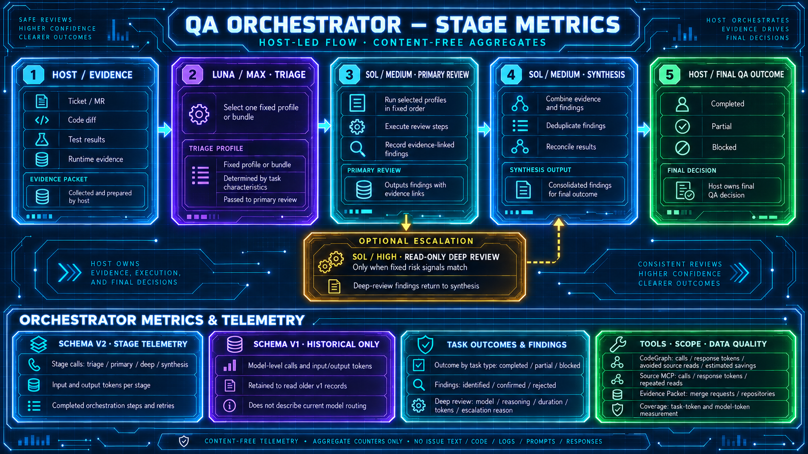

# QA Orchestrator

QA Orchestrator is a small deterministic FastMCP service for host-owned QA reviews and content-free aggregate metrics. It keeps orchestration state bounded; evidence, source code, logs, prompts, model responses, and final decisions remain with the primary host agent.

## How it works

1. The primary host obtains authoritative evidence from the required systems and classifies the QA task.
2. The host calls `start_qa_orchestration`. The orchestrator creates a content-free session and returns the first step from the locally selected model policy. The default is OpenAI GPT-6 Luna (`gpt-6-luna`) with `max` reasoning and GPT-6 Sol (`gpt-6-sol`) for review; run `qa-orch setup` to choose OpenAI or Anthropic and the model IDs.
3. The host runs each stage in its configured model environment and sends the orchestrator only a structured signal after each stage:
   - selected triage model + configured reasoning (default `max`) — selection of one fixed review bundle or one compatibility profile;
   - selected primary model + configured reasoning (default `medium`) — primary review of every profile in the fixed order;
   - optional selected deep model + configured reasoning (default `high`) — one read-only deep analysis selected by fixed risk signals;
   - selected synthesis model + configured reasoning (default `medium`) — synthesis.
   Every returned model policy includes `speed=1.0`; the host must keep this value for the selected stage.
4. The host validates findings, runtime evidence, and limitations, then calls `record_qa_task_outcome` once. For an orchestrated task it passes the same `run_id` so the orchestrator can close the session.

The orchestrator does not call models, choose severity or release readiness, or perform external writes.

### Bundles and profile names

Luna selects one fixed bundle or one compatibility profile. Sol executes bundle profiles sequentially. After every role, the host sends `completed_profile`, and the orchestrator returns `current_profile` and `completed_profiles`. Deep review or synthesis is available only after the final role. The transition identifiers `terra_primary_review` and `terra_synthesis` remain stable; choose the model from the returned `model_policy`, never from the step name.

| Bundle | Profile order |
|---|---|
| `ordinary_mr` | `code_explorer` → `code_reviewer` → `pr_test_analyzer` |
| `widget` | `code_explorer` → `react_reviewer` → `typescript_reviewer` → `pr_test_analyzer` |
| `security` | `code_explorer` → `security_reviewer` → `silent_failure_hunter` |
| `autotest` | `code_reviewer` → `pr_test_analyzer` → `typescript_reviewer` |
| `requirements` | `code_explorer` → `code_reviewer` |

Technical profiles and display names:

| Profile | Host-facing name |
|---|---|
| `code_explorer` | `Faraday — Evidence Investigator` |
| `code_reviewer` | `Code Reviewer` |
| `pr_test_analyzer` | `Test Analyzer` |
| `security_reviewer` | `Security Reviewer` |
| `silent_failure_hunter` | `Silent Failure Hunter` |
| `typescript_reviewer` | `TypeScript Reviewer` |
| `react_reviewer` | `React Reviewer` |

Faraday is only the internal display name of the `code_explorer` profile. No external agent, service, package, or model is connected under that name.

Ordinary MR flow with optional escalation:

```text
Luna / Max → Ordinary MR Review
Sol / Medium → Faraday — Evidence Investigator → Code Reviewer → Test Analyzer
  ├─ no escalation ───────────────────────────────→ Sol / Medium Synthesis
  └─ fixed risk signals match → Sol / High Deep Review → Sol / Medium Synthesis
Host → Final QA outcome
```

With the final primary-review role, the host may send boolean `risk_signals` in the same `advance_qa_orchestration` call as the final `completed_profile`. The orchestrator inserts `Sol / High → Deep read-only review` before synthesis when one of the fixed escalation rules matches, then returns to Sol / Medium synthesis. Do not send `risk_signals` on the later synthesis transition. It returns the matched rules and fixed reason codes as `deep_assessment`; raw evidence never enters the orchestrator.

Deep-review rules:

1. `high_risk_domain` + `evidence_uncertain`;
2. any two of `cross_system_scope`, `multiple_plausible_causes`, `non_reproducible`, and `high_blast_radius`;
3. `evidence_conflict` together with `high_risk_domain`, `cross_system_scope`, or `high_blast_radius`.

The legacy `needs_deep_analysis` + `reason_code` transition remains supported for compatibility.

For low-risk, narrow reviews, Luna may select one compatibility profile instead of a bundle: `code_reviewer` for a small behavior change, `pr_test_analyzer` for a test-only change, `typescript_reviewer` for a TypeScript-only change, or `react_reviewer` for a React-only change. Broad or cross-concern reviews continue to use a fixed bundle.

Keep one compact per-task Evidence Packet with stable evidence references (`E1`, `E2`, ...) and bounded finding candidates (`F-01`, `F-02`, ...). Do not repeat the full diff or raw logs in every model stage.

## QA Orchestrator at a glance

### Workflow and content-free stage metrics



## MCP interface

The service publishes exactly six tools:

| Tool | Purpose |
|---|---|
| `prepare_review_route(agent_profile)` | Deterministic checklist for one of the seven profiles |
| `start_qa_orchestration(task_type)` | Create a host-owned orchestration session |
| `advance_qa_orchestration(...)` | Make one structured transition between stages |
| `get_qa_orchestration(run_id)` | Read the current content-free state |
| `record_qa_task_outcome(...)` | Record one anonymized QA-task result |
| `get_metrics_report(days)` | Return an aggregate report for a positive time range |

Bundle orchestration flow:

```text
Luna/max → Sol/profile[1] → ... → Sol/profile[N]
                                      ↘ optional Sol/high ↗
                                           Sol synthesis → host outcome
```

Sessions are kept in process memory only. The default TTL is 1,800 seconds and the maximum is 100 active sessions; the shared cache is also bounded, so older terminal sessions may be evicted when capacity is needed. Repeating the final call is idempotent while its session is retained. After a restart, the host starts a new session. `read_only=true` and `host_owns_decisions=true` are part of every state.

After synthesis, the session waits for the final host outcome. A call to `record_qa_task_outcome` with the `run_id` of the current session is treated as orchestrated automatically; `orchestration_used=true` may be sent explicitly, but must not contradict the `run_id`. The orchestrator associates counters with the actual branch and moves it to `completed`, `partial`, or `blocked`. For a session stopped at an intermediate stage, first pass `partial` or `blocked` to `advance_qa_orchestration`. Repeating the exact same call for the same `run_id` is idempotent; a changed payload is rejected as a conflict. For a regular task without orchestration, omit `run_id`.

### Review profiles

`prepare_review_route` returns the focus, required sections, constraints, escalation signals, and display name for one profile. For a bundle, the host calls the route for every profile in the returned fixed order and passes its technical identifier in `completed_profile` after each call.

Common route sections are `Scope`, `Checklist`, `Candidate Coverage Gaps`, `Positive Observations`, and `Unverified`.

## Responsibility boundary

The primary host is responsible for:

- obtaining and validating evidence;
- calling the issue tracker, code host, test-management system, observability and logging systems, documentation and chat systems, code index, and the file system;
- running triage, primary-review, synthesis, and any optional deep-review stage under the policy;
- confirmed findings, severity, release/readiness judgment, and the final QA response;
- file changes and all external writes.

QA Orchestrator is responsible only for fixed routing, state transitions, read-only constraints, and content-free metrics. `advance_qa_orchestration` must not receive an Evidence Packet, prompt, model output, source text, logs, paths, or an arbitrary reason.

## Requirements

- Python 3.12+;
- [`uv`](https://docs.astral.sh/uv/);
- an MCP client that supports STDIO;
- a POSIX system: macOS or Linux.

Native Windows is not supported by the current release because the source
launcher and metrics locking use POSIX facilities. Windows users can run the
server inside WSL2; native Windows support requires a separate compatibility
change.

## Installation

For the complete setup—including Codex and Claude Code registration, host instructions, verification, and troubleshooting—see the [installation guide](docs/INSTALLATION.md).

```bash
git clone https://github.com/Rbkmen/qa-orchestrator.git
cd qa-orchestrator
uv sync
uv run qa-orchestrator-doctor
uv run qa-orch setup
```

The launcher first uses the project's `.venv`, then the active `VIRTUAL_ENV`, or an installed `qa-orchestrator` from `PATH`; no separate background process is required.

For a POSIX client that supports `uvx`, a checkout is optional:

```bash
uvx --from git+https://github.com/Rbkmen/qa-orchestrator.git qa-orch setup
```

This saves the model policy in your user configuration. Register the server command with your
MCP client so the client starts it when needed; do not run the server command
directly in a terminal. For Codex without a checkout:

```bash
codex mcp add qa-orchestrator -- uvx \
  --from git+https://github.com/Rbkmen/qa-orchestrator.git \
  qa-orchestrator
```

Pin a release tag or commit instead of the default branch for reproducible
team configuration.

The setup wizard first lets you choose Russian or English for that run, then
stores only the provider label, model IDs, and the selected provider-specific
reasoning/effort values in the local `model-policy.json`; the language is not
saved, and the wizard never asks for or stores API keys. Choose a provider and
model that your host client can use; the wizard records the policy but does not
configure provider access. From a checkout, use `uv run qa-orch config show` and
`uv run qa-orch reload`. Without a checkout, prefix those commands with
`uvx --from git+https://github.com/Rbkmen/qa-orchestrator.git`. Colors in the
wizard distinguish providers, model IDs, and reasoning values; set `NO_COLOR=1`
to disable them or `FORCE_COLOR=1` to force them.

Example for Codex with a local checkout:

```bash
codex mcp add qa-orchestrator -- "$(pwd)/scripts/qa-orchestrator"
```

The two supported host integrations are described in the [client guides](docs/clients/).

## Configuration

By default, metrics are written to `$HOME/.qa-orchestrator/metrics.jsonl`.

| Variable | Default |
|---|---:|
| `QA_ORCHESTRATOR_DATA_DIR` | `$HOME/.qa-orchestrator` |
| `QA_ORCHESTRATOR_METRICS_RETENTION_DAYS` | `30` |
| `QA_ORCHESTRATOR_METRICS_MAX_EVENTS` | `10000` |
| `QA_ORCHESTRATOR_ORCHESTRATION_TTL_SECONDS` | `1800` |
| `QA_ORCHESTRATOR_ORCHESTRATION_MAX_SESSIONS` | `100` |
| `QA_ORCHESTRATOR_MODEL_POLICY_PATH` | `$HOME/.qa-orchestrator/model-policy.json` |

## Metrics

Every `record_qa_task_outcome` call must include the base counters `codegraph_calls`, `source_mcp_calls`, `findings_identified`, `findings_confirmed`, `findings_rejected`, and `repeated_source_reads`; send `0` when a counter is empty.

New `record_qa_task_outcome` events use schema v2; the service assigns the version. Send stage call counters `triage_calls`, `primary_review_calls`, `deep_review_calls`, and `synthesis_calls`, plus shared `orchestration_steps_completed` and `orchestration_retries`. For a completed bundle with `N` profiles, report at least one triage call, `N` primary-review calls, one synthesis call, and `N+2` completed steps. If deep review ran, report its actual call count (at least one) and one additional step. A selected deep branch that stops before the deep review has `deep_review_calls=0` and omits deep model metadata.

When the deep review runs, send the configured deep-stage model in `deep_model` and its configured `deep_reasoning` (default `high`). Stage token measurements are optional: `triage_input_tokens`, `triage_output_tokens`, `primary_review_input_tokens`, `primary_review_output_tokens`, `synthesis_input_tokens`, and `synthesis_output_tokens`; deep-review tokens use `deep_input_tokens` and `deep_output_tokens`. Evidence Packet token count, merge-request/repository counts, and deep-analysis finding counters are also optional. Do not send model-family call/token fields for new events.

Other optional counters include `codegraph_response_tokens`, `source_mcp_response_tokens`, and `avoided_source_read_tokens`; deep-review duration is optional as well.

For an orchestrated task, use the `run_id` returned by `start_qa_orchestration`; the opaque identifier itself is not written to the JSONL metric.

Values must be non-negative and internally consistent. JSONL contains no issue keys, paths, source text, code, logs, prompts, or model responses. The report is available through MCP or locally:

Schema-v1 rows already stored remain readable. Their model-family totals stay in the legacy report fields; schema-v2 stage totals appear separately as `stage_calls` and `stage_tokens`. The report keeps exact deep-model IDs and combines shared task totals across versions. Incomplete v2 token measurements contribute known token values but not to the complete-measurement count.

```bash
uv run qa-orchestrator-report
uv run qa-orchestrator-report --days 30
```

## Clients and rules

- [Codex](docs/clients/codex.md)
- [Claude Code](docs/clients/claude-code.md)
- [Shared routing policy](docs/ORCHESTRATION_POLICY.md)
- [Client-rule templates](client-rules/)
- [Security policy](SECURITY.md)

## Development

See [CONTRIBUTING.md](CONTRIBUTING.md). Any change to the public MCP contract must include an exact tool-surface test and a check that evidence, decisions, and external writes remain with the primary host.
