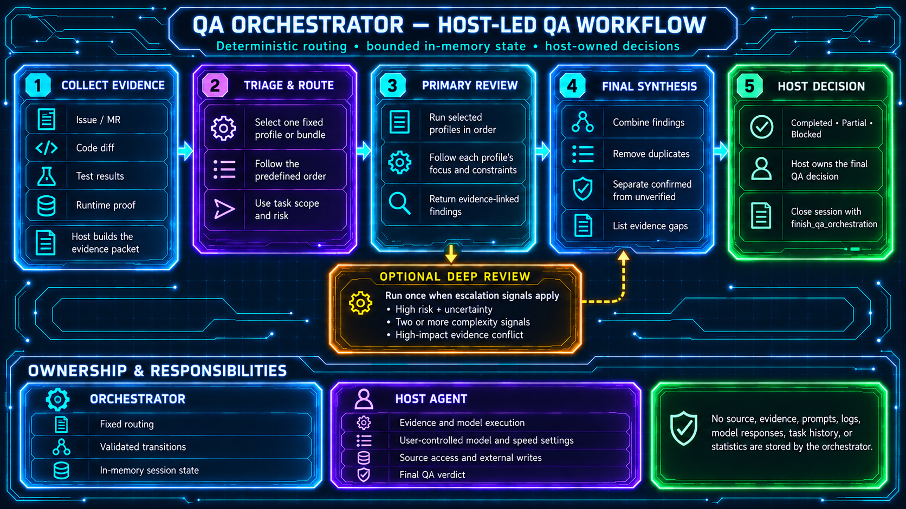

# QA Orchestrator

QA Orchestrator is a small deterministic FastMCP service for host-owned QA reviews. It keeps orchestration state bounded; evidence, source code, logs, prompts, model responses, and final decisions remain with the primary host agent.

## How it works

1. The primary host obtains authoritative evidence from the required systems and classifies the QA task.
2. The host calls `start_qa_orchestration`. The orchestrator creates a content-free session and returns the first step and its configured policy. Run `qa-orch setup` to choose OpenAI or Anthropic and configure models and reasoning for each stage.
3. The host runs each stage in its configured model environment and sends the orchestrator only a structured signal after each stage:
   - triage — select one fixed review bundle or one compatibility profile;
   - primary review — review every selected profile in the fixed order;
   - optional deep review — perform one read-only analysis when fixed risk signals match;
   - final synthesis — consolidate the results.
   Each stage uses the model and reasoning configured for it in the returned `model_policy`.
   The returned policy selects the provider, model, and reasoning for each stage. Execution speed and latency preferences remain controlled by the user's host/provider settings; the orchestrator does not set or override them.
4. The host validates findings, runtime evidence, and limitations. For an orchestrated task, it calls `finish_qa_orchestration` with the same `run_id` and its final outcome.

The orchestrator does not call models, choose severity or release readiness, or perform external writes.

## QA Orchestrator at a glance



### Bundles and profile names

The triage stage selects one fixed bundle or one compatibility profile. The primary-review stage executes bundle profiles sequentially. After every role, the host sends `completed_profile`, and the orchestrator returns `current_profile` and `completed_profiles`. Deep review or synthesis is available only after the final role. Transition identifiers are model-neutral; choose the model from the returned `model_policy`, never from the step name.

| Bundle | Profile order |
|---|---|
| `ordinary_mr` | `code_explorer` → `code_reviewer` → `pr_test_analyzer` |
| `widget` | `code_explorer` → `react_reviewer` → `typescript_reviewer` → `pr_test_analyzer` |
| `security` | `code_explorer` → `security_reviewer` → `silent_failure_hunter` |
| `autotest` | `code_reviewer` → `pr_test_analyzer` → `typescript_reviewer` |
| `requirements` | `code_explorer` → `code_reviewer` |

Technical profiles and display names:

| Profile | Host-facing name |
|---|---|
| `code_explorer` | `Faraday — Evidence Investigator` |
| `code_reviewer` | `Code Reviewer` |
| `pr_test_analyzer` | `Test Analyzer` |
| `security_reviewer` | `Security Reviewer` |
| `silent_failure_hunter` | `Silent Failure Hunter` |
| `typescript_reviewer` | `TypeScript Reviewer` |
| `react_reviewer` | `React Reviewer` |

Faraday is only the internal display name of the `code_explorer` profile. No external agent, service, package, or model is connected under that name.

Ordinary MR flow with optional escalation:

```text
Triage → Ordinary MR Review
Primary review → Faraday — Evidence Investigator → Code Reviewer → Test Analyzer
  ├─ no escalation ───────────────────────────────→ Final synthesis
  └─ fixed risk signals match → Deep review → Final synthesis
Host → Final QA outcome
```

With the final primary-review role, the host must send the structured boolean `risk_signals` object in the same `advance_qa_orchestration` call as the final `completed_profile` (send `{}` when no signals apply). When a fixed escalation rule matches, the orchestrator inserts a deep read-only review before final synthesis. Do not send `risk_signals` on the later synthesis transition. It returns the matched rules and fixed reason codes as `deep_assessment`; raw evidence never enters the orchestrator. The legacy explicit `needs_deep_analysis=true` plus `reason_code` path remains accepted for existing clients.

Deep-review rules:

1. `high_risk_domain` + `evidence_uncertain`;
2. any two of `cross_system_scope`, `multiple_plausible_causes`, `non_reproducible`, and `high_blast_radius`;
3. `evidence_conflict` together with `high_risk_domain`, `cross_system_scope`, or `high_blast_radius`.

The legacy `needs_deep_analysis` + `reason_code` transition remains supported for compatibility.

For low-risk, narrow reviews, the triage stage may select one compatibility profile instead of a bundle: `code_reviewer` for a small behavior change, `pr_test_analyzer` for a test-only change, `typescript_reviewer` for a TypeScript-only change, or `react_reviewer` for a React-only change. Broad or cross-concern reviews continue to use a fixed bundle.

Keep one compact per-task Evidence Packet with stable evidence references (`E1`, `E2`, ...) and bounded finding candidates (`F-01`, `F-02`, ...). Do not repeat the full diff or raw logs in every model stage.

## MCP interface

The service publishes exactly five tools:

| Tool | Purpose |
|---|---|
| `prepare_review_route(agent_profile)` | Deterministic checklist for one of the seven profiles |
| `start_qa_orchestration(task_type)` | Create a host-owned orchestration session |
| `advance_qa_orchestration(...)` | Make one structured transition between stages |
| `get_qa_orchestration(run_id)` | Read the current content-free state |
| `finish_qa_orchestration(run_id, outcome)` | Finalize a host-owned orchestration session |

Bundle orchestration flow:

```text
Triage → Primary review[1] → ... → Primary review[N]
                                      ↘ optional Deep review ↗
                                           Final synthesis → Host outcome
```

Sessions are kept in process memory only. The default TTL is 1,800 seconds and the maximum is 100 active sessions; the shared cache is also bounded, so older terminal sessions may be evicted when capacity is needed. Repeating the final call is idempotent while its session is retained. After a restart, the host starts a new session. `read_only=true` and `host_owns_decisions=true` are part of every state.

After synthesis, the session waits for the host's final outcome. Call `finish_qa_orchestration` with the session `run_id` and `completed`, `partial`, or `blocked`. For an early stop, first pass `partial` or `blocked` to `advance_qa_orchestration`, then finish the session with the same outcome. Repeating the same finalization is idempotent; a conflicting outcome is rejected. Tasks that do not use orchestration need no finalization call. The service does not store or report task statistics.

### Review profiles

`prepare_review_route` returns the focus, required sections, constraints, escalation signals, and display name for one profile. For a bundle, the host calls the route for every profile in the returned fixed order and passes its technical identifier in `completed_profile` after each call.

Common route sections are `Scope`, `Checklist`, `Candidate Coverage Gaps`, `Positive Observations`, and `Unverified`.

## Responsibility boundary

The primary host is responsible for:

- obtaining and validating evidence;
- calling the issue tracker, code host, test-management system, observability and logging systems, documentation and chat systems, code index, and the file system;
- running triage, primary-review, synthesis, and any optional deep-review stage under the policy;
- confirmed findings, severity, release/readiness judgment, and the final QA response;
- file changes and all external writes.

QA Orchestrator is responsible only for fixed routing, state transitions, read-only constraints, and bounded session finalization. `advance_qa_orchestration` must not receive an Evidence Packet, prompt, model output, source text, logs, paths, or an arbitrary reason.

## Requirements

- Python 3.12+;
- [`uv`](https://docs.astral.sh/uv/);
- an MCP client that supports STDIO;
- a POSIX system: macOS or Linux.

Native Windows is not supported by the current release because the source
launcher uses POSIX facilities. Windows users can run the server inside WSL2;
native Windows support requires a separate compatibility change.

## Installation

For the complete setup—including Codex and Claude Code registration, host instructions, verification, and troubleshooting—see the [installation guide](docs/INSTALLATION.md).

```bash
git clone https://github.com/Rbkmen/qa-orchestrator.git
cd qa-orchestrator
uv sync
uv run qa-orchestrator-doctor
uv run qa-orch setup
```

The launcher first uses the project's `.venv`, then the active `VIRTUAL_ENV`, or an installed `qa-orchestrator` from `PATH`; no separate background process is required.

For a POSIX client that supports `uvx`, a checkout is optional:

```bash
uvx --from git+https://github.com/Rbkmen/qa-orchestrator.git qa-orch setup
```

This saves the model policy in your user configuration. Register the server command with your
MCP client so the client starts it when needed; do not run the server command
directly in a terminal. For Codex without a checkout:

```bash
codex mcp add qa-orchestrator -- uvx \
  --from git+https://github.com/Rbkmen/qa-orchestrator.git \
  qa-orchestrator
```

Pin a release tag or commit instead of the default branch for reproducible
team configuration.

The setup wizard first lets you choose Russian or English for that run, then
stores only the provider label, model IDs, and the selected provider-specific
reasoning/effort values in the local `model-policy.json`; the language is not
saved, and the wizard never asks for or stores API keys. Choose a provider and
model that your host client can use; the wizard records the policy but does not
configure provider access. From a checkout, use `uv run qa-orch config show` and
`uv run qa-orch reload`. Without a checkout, prefix those commands with
`uvx --from git+https://github.com/Rbkmen/qa-orchestrator.git`. Colors in the
wizard distinguish providers, model IDs, and reasoning values; set `NO_COLOR=1`
to disable them or `FORCE_COLOR=1` to force them.

The wizard uses a local recommendation/capability catalog and does not contact
provider APIs. For custom model IDs, verify that the host account can access
the model and supports the selected reasoning/effort value.

Example for Codex with a local checkout:

```bash
codex mcp add qa-orchestrator -- "$(pwd)/scripts/qa-orchestrator"
```

The two supported host integrations are described in the [client guides](docs/clients/).

## Configuration

| Variable | Default |
|---|---:|
| `QA_ORCHESTRATOR_DATA_DIR` | `$HOME/.qa-orchestrator` |
| `QA_ORCHESTRATOR_ORCHESTRATION_TTL_SECONDS` | `1800` |
| `QA_ORCHESTRATOR_ORCHESTRATION_MAX_SESSIONS` | `100` |
| `QA_ORCHESTRATOR_MODEL_POLICY_PATH` | `$HOME/.qa-orchestrator/model-policy.json` |

## Finalize an orchestration

After synthesis, pass the host-owned final outcome and the original `run_id` to
`finish_qa_orchestration`. For an early stop, pass the same `partial` or
`blocked` outcome that ended the `advance_qa_orchestration` transition. The
session remains in process memory only and expires according to the configured
TTL; no task history or statistics are written to disk.

## Clients and rules

- [Codex](docs/clients/codex.md)
- [Claude Code](docs/clients/claude-code.md)
- [Shared routing policy](docs/ORCHESTRATION_POLICY.md)
- [Client-rule templates](client-rules/)
- [Security policy](SECURITY.md)

## Development

See [CONTRIBUTING.md](CONTRIBUTING.md). Any change to the public MCP contract must include an exact tool-surface test and a check that evidence, decisions, and external writes remain with the primary host.
