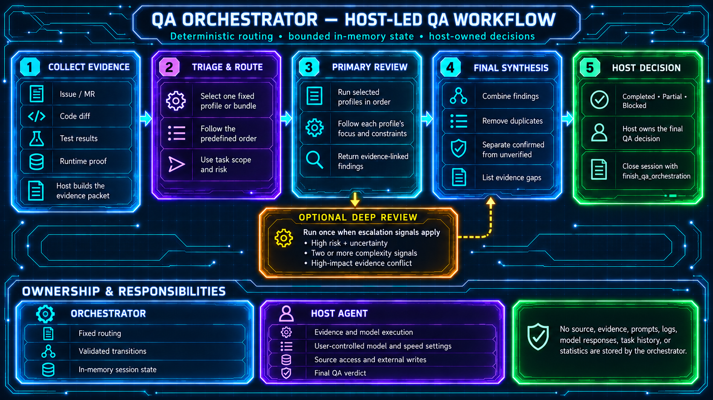

# QA Orchestrator
[](https://glama.ai/mcp/servers/Rbkmen/qa-orchestrator)

QA Orchestrator is a small deterministic FastMCP service for host-owned QA reviews. It keeps orchestration state bounded; evidence, source code, logs, prompts, model responses, and final decisions remain with the primary host agent.

## Quick start

Requires Python 3.12+, [uv](https://docs.astral.sh/uv/), Git, and a local
MCP client with STDIO support.

```bash
git clone https://github.com/Rbkmen/qa-orchestrator.git
cd qa-orchestrator
uv sync --locked
uv run qa-orch setup
uv run qa-orchestrator-doctor
```

Then [register the server and add the host instructions](docs/INSTALLATION.md#2-connect-it-to-codex).
The MCP client starts the server. To inspect the models loaded by that process,
call `get_qa_orchestration_model_policy` with `{}` in the client.
See the [installation guide](docs/INSTALLATION.md) for Windows, Claude Code,
installation without a checkout, updates, and troubleshooting.

## How it works

1. The primary host obtains authoritative evidence from the required systems and classifies the QA task.
2. The host calls `start_qa_orchestration`. The orchestrator creates a content-free session and returns the first step and its configured policy. Run `qa-orch setup` to choose OpenAI or Anthropic and configure models and reasoning for each stage.
3. The host runs each stage in its configured model environment and sends the orchestrator only a structured signal after each stage:
   - triage — select one fixed review bundle or one compatibility profile;
   - primary review — review every selected profile in the fixed order;
   - optional deep review — perform one read-only analysis when fixed risk signals match;
   - final synthesis — consolidate the results.
   Each stage uses the model and reasoning configured for it in the returned `model_policy`.
   The returned policy selects the provider, model, and reasoning for each stage. Execution speed and latency preferences remain controlled by the user's host/provider settings; the orchestrator does not set or override them.
4. The host validates findings, runtime evidence, and limitations. For an orchestrated task, it calls `finish_qa_orchestration` with the same `run_id` and its final outcome.

The orchestrator does not call models, choose severity or release readiness, or perform external writes. Its client-rule templates provide portable host-agent instructions for evidence quality and finding presentation; registering the MCP server alone does not load those instructions into the host.

## Choose a review path

Use one compatibility profile by default for a routine, narrowly scoped,
low-risk change with one main concern. Use a fixed bundle for broad,
cross-concern, or high-risk changes. For example, a small Ruby guard change can
use `ruby_reviewer`; a change spanning a Rails endpoint, a background job, and
their tests fits `ruby_backend`.

`recommended_bundles` is a task-type shortlist, not a risk score or a required
selection. The host inspects the diff and chooses the initial profile or
bundle. The host sends structured risk signals after primary review; the
orchestrator applies its fixed rules to decide whether optional deep review
follows.

### Example: the same review with and without the orchestrator

| | Ordinary review guided by `AGENTS.md` | Review with QA Orchestrator |
|---|---|---|
| Small Ruby guard change | The host chooses a reviewer prompt and tracks the review in the conversation. | The host selects `ruby_reviewer`; the MCP validates the transition and returns the bounded session state. |
| Broad Ruby change across an endpoint, job, and tests | The host coordinates review steps from its instructions. | The host selects `ruby_backend`; the fixed reviewer order and required transitions are explicit. |
| Deeper review | The host decides from its own instructions and evidence. | The host sends structured risk signals; the orchestrator applies fixed escalation rules. |
| Ownership | The host gathers evidence and makes the final decision. | The host still owns evidence, model calls, findings, and the final decision; the orchestrator receives no source or raw evidence. |

The orchestrator adds a validated workflow contract and bounded progress state.
It does not replace host instructions or perform the review itself.

## QA Orchestrator at a glance



The diagram shows default memory-only operation. Optional SQLite recovery is
described in the [MCP interface](#mcp-interface).

### Bundles and profile names

The triage stage selects one fixed bundle or one compatibility profile. `start_qa_orchestration` returns `recommended_bundles` as a task-type-based shortlist; it does not restrict `allowed_bundles`. Choose the route from the changed files and confirmed project stack. The primary-review stage executes bundle profiles sequentially. After every role, the host sends `completed_profile`, and the orchestrator returns `current_profile` and `completed_profiles`. Use the updated session returned by `advance_qa_orchestration` for the next action and model policy; call `get_qa_orchestration` only when resuming or recovering a session. Deep review or synthesis is available only after the final role. Transition identifiers are model-neutral; choose the model from the returned `model_policy`, never from the step name.

| Bundle | Profile order |
|---|---|
| `ordinary_mr` | `code_explorer` → `code_reviewer` → `pr_test_analyzer` |
| `widget` | `code_explorer` → `react_reviewer` → `typescript_reviewer` → `pr_test_analyzer` |
| `widget_js` | `code_explorer` → `code_reviewer` → `react_reviewer` → `pr_test_analyzer` |
| `ruby_backend` | `code_explorer` → `ruby_reviewer` → `pr_test_analyzer` |
| `python_backend` | `code_explorer` → `python_reviewer` → `pr_test_analyzer` |
| `mobile` | `code_explorer` → `mobile_reviewer` → `pr_test_analyzer` |
| `security` | `code_explorer` → `security_reviewer` → `silent_failure_hunter` |
| `autotest` | `code_reviewer` → `pr_test_analyzer` → `typescript_reviewer` |
| `requirements` | `code_explorer` → `code_reviewer` |

`autotest` and `widget` include a TypeScript review role; select them when TypeScript review is relevant. Use `ordinary_mr` for broad non-TypeScript automation, `widget_js` for broad JavaScript React changes, `ruby_backend` for broad Ruby backend changes, `python_backend` for broad Python/MCP changes, and `mobile` for broad React Native or native iOS/Android changes. Choose from the changed files and confirmed project manifests, not the repository name alone; monorepos can contain several stacks.

Technical profiles and display names:

| Profile | Host-facing name |
|---|---|
| `code_explorer` | `Faraday — Evidence Investigator` |
| `code_reviewer` | `Code Reviewer` |
| `pr_test_analyzer` | `Test Analyzer` |
| `security_reviewer` | `Security Reviewer` |
| `silent_failure_hunter` | `Silent Failure Hunter` |
| `typescript_reviewer` | `TypeScript Reviewer` |
| `react_reviewer` | `React Reviewer` |
| `ruby_reviewer` | `Ruby Reviewer` |
| `python_reviewer` | `Python Reviewer` |
| `mobile_reviewer` | `Mobile Reviewer` |

Faraday is only the internal display name of the `code_explorer` profile. No external agent, service, package, or model is connected under that name.

Ordinary MR flow with optional escalation:

```text
Triage → Ordinary MR Review
Primary review → Faraday — Evidence Investigator → Code Reviewer → Test Analyzer
  ├─ no escalation ───────────────────────────────→ Final synthesis
  └─ fixed risk signals match → Deep review → Final synthesis
Host → Final QA outcome
```

With the final primary-review role, the host must send the structured boolean `risk_signals` object in the same `advance_qa_orchestration` call as the final `completed_profile` (send `{}` when no signals apply). Deep review is derived only from the fixed signal rules. Do not send `risk_signals` on the later synthesis transition. The returned session includes matched rules and fixed reason codes as `deep_assessment`; raw evidence never enters the orchestrator.

Deep-review rules:

1. `high_risk_domain` + `evidence_uncertain`;
2. any two of `cross_system_scope`, `multiple_plausible_causes`, `non_reproducible`, and `high_blast_radius`;
3. `evidence_conflict` together with `high_risk_domain`, `cross_system_scope`, or `high_blast_radius`.

For low-risk, narrow reviews, the triage stage may select one compatibility profile instead of a bundle: `code_reviewer` for a small behavior change, `pr_test_analyzer` for a test-only change, `typescript_reviewer` for a TypeScript-only change, `react_reviewer` for a React-only change, `ruby_reviewer` for a Ruby-only change, `python_reviewer` for a Python/MCP-only change, or `mobile_reviewer` for a React Native/native-platform-only change. Broad or cross-concern reviews continue to use a fixed bundle.

Keep one compact per-task Evidence Packet with stable evidence references (`E1`, `E2`, ...) and bounded finding candidates (`F-01`, `F-02`, ...). Do not repeat the full diff or raw logs in every model stage.

## MCP interface

The service publishes exactly nine tools:

| Tool | Purpose |
|---|---|
| `prepare_qa_orchestration(agent_profile)` | Return the fixed checklist for one profile without creating a session |
| `get_qa_orchestration_catalog()` | Discover all profiles, bundle purposes and ordered routes, and task-type shortlists without creating a session |
| `get_qa_orchestration_model_policy()` | Read the server-wide provider, models, and reasoning for all stages of new sessions; no `run_id` |
| `start_qa_orchestration(task_type)` | Create a session and return the task-based bundle shortlist |
| `advance_qa_orchestration(...)` | Record one active review step's completion or an early stop; return the next action |
| `get_qa_orchestration(run_id)` | Read one existing session's step, status, next action, and current-stage model policy |
| `list_qa_orchestrations()` | Recover lost `run_id` values from brief metadata for non-expired sessions retained by this server |
| `finish_qa_orchestration(run_id, outcome)` | Finalize the host-owned session outcome after synthesis or a recorded early stop |
| `delete_qa_orchestration(run_id)` | Immediately discard one session's in-memory state and its configured recovery record |

Before starting a session or choosing its triage route, call `get_qa_orchestration_catalog` with `{}`. It returns all available profiles with their display names and focus, all bundles with usage guidance and ordered profile IDs, and `recommended_bundles_by_task_type`. Recommendations are shortlists, not restrictions; choose from changed files and confirmed stack. For a narrow concern, choose one profile and get its detailed checklist through `prepare_qa_orchestration`. For broad work, select a bundle and preserve its profile order. The catalog is fixed, independent of session/model-policy state, and does not create sessions, change TTL, or write storage.

Bundle orchestration flow:

```text
Triage → Primary review[1] → ... → Primary review[N]
                                      ↘ optional Deep review ↗
                                           Final synthesis → Host outcome
```

Sessions are kept in process memory by default. Successful state changes refresh the 1,800-second default TTL; reads do not. The maximum is 100 active sessions, and the shared cache is bounded, so older terminal sessions may be evicted when capacity is needed. Repeating the final call is idempotent while its session is retained. After a restart, the host starts a new session unless optional recovery storage is enabled. `read_only=true` and `host_owns_decisions=true` are part of every state.

Set `QA_ORCHESTRATOR_SESSION_STORE_PATH` to opt into a local SQLite file that restores unfinished orchestration state after a restart. It stores only the current structured session needed for recovery; finalization removes that row. It never stores evidence, prompts, source, logs, model responses, finalized outcomes, history, or statistics. Use one server process per store file. The default remains memory-only.

If a `run_id` is lost, call `list_qa_orchestrations` with `{}`. Its `sessions` entries include the ID, task type, status, stage, selected route, current profile, and expiry; use these to identify the intended session, then call `get_qa_orchestration` with its ID. Confirm the intended session if several entries match. The list includes retained terminal sessions and is sorted by expiry descending, with `run_id` as tie-breaker. It does not change state, renew TTL, or write storage. An empty list means no non-expired sessions are retained by this server; expired or evicted sessions cannot be recovered. After a restart, only unfinished sessions restored from configured recovery storage are available.

After synthesis, the session waits for the host's final outcome. Call `finish_qa_orchestration` with the session `run_id` and `completed`, `partial`, or `blocked`. For an early stop, first pass `partial` or `blocked` to `advance_qa_orchestration`, then finish the session with the same outcome. Repeating the same finalization is idempotent; a conflicting outcome is rejected. Tasks that do not use orchestration need no finalization call. The service does not store or report task statistics.

To intentionally discard a session, call `delete_qa_orchestration` with its `run_id`. It removes only that session from memory and optional SQLite recovery storage, at any lifecycle stage, and frees its capacity immediately. It returns `{ "run_id": "qar-...", "deleted": true }`; `deleted` confirms absence, so an already missing or expired ID also succeeds. The ID can no longer be read, advanced, finalized, or restored after restart. Storage failure leaves memory state intact and can be retried. Deletion records no QA outcome and does not stop host tasks or model executions. Use normal early-stop/finalization when the outcome should remain available; delete only when the host intends to discard that session.

### Review profiles

`prepare_qa_orchestration` returns the focus, required sections, constraints, escalation signals, and display name for one profile. For a bundle, the host calls the route for every profile in the returned fixed order and passes its technical identifier in `completed_profile` after each call.

`required_sections` is profile-specific: the evidence investigator returns `Scope`, `Evidence Map`, and `Unverified`; test analysis returns `Scope`, `Coverage Gaps`, and `Unverified`; implementation and specialist reviews return `Scope`, `Finding Candidates`, `Coverage Gaps`, and `Unverified`.

Use the [local profile evaluation pack](docs/PROFILE_EVALUATION.md) to smoke-check role boundaries and bundle selection without collecting task statistics.

## Responsibility boundary

The primary host is responsible for:

- obtaining and validating evidence;
- calling the issue tracker, code host, test-management system, observability and logging systems, documentation and chat systems, code index, and the file system;
- running triage, primary-review, synthesis, and any optional deep-review stage under the policy;
- confirmed findings, severity, release/readiness judgment, and the final QA response;
- file changes and all external writes.

QA Orchestrator is responsible only for fixed routing, state transitions, read-only constraints, and bounded session finalization. `advance_qa_orchestration` must not receive an Evidence Packet, prompt, model output, source text, logs, paths, or an arbitrary reason.

The `read_only=true` flag describes the review boundary. MCP annotations mark
`start`, `advance`, and `finish` as state-changing tools because they update
local orchestration state. Profile lookup, model-policy inspection, and state
lookup are annotated as read-only.

## Requirements

- Python 3.12+;
- [`uv`](https://docs.astral.sh/uv/);
- an MCP client that supports STDIO;
- Windows, macOS, or Linux.

On Windows, `uv sync` installs the native MCP entry point at
`.venv\Scripts\qa-orchestrator-mcp.exe`. macOS and Linux use the POSIX
source launcher.

## Installation

For the complete setup—including Codex and Claude Code registration, host instructions, verification, and troubleshooting—see the [installation guide](docs/INSTALLATION.md).

Start with the [quick start](#quick-start) above to install from a checkout.

On macOS and Linux, the source launcher uses the project's `.venv`, the active
`VIRTUAL_ENV`, or an installed `qa-orchestrator-mcp` from `PATH`. On Windows,
use the installed `.venv\Scripts\qa-orchestrator-mcp.exe` entry point. No
separate background process is required.

For clients that support `uvx`, a checkout is optional:

Replace `<commit-sha>` with the full commit hash and use the same hash in the
setup and server commands.

```bash
uvx --from 'git+https://github.com/Rbkmen/qa-orchestrator.git@<commit-sha>' qa-orch setup
```

This saves the model policy in your user configuration. Register the server command with your
MCP client so the client starts it when needed; do not run the server command
directly in a terminal. For Codex without a checkout:

```bash
codex mcp add qa-orchestrator -- uvx \
  --from 'git+https://github.com/Rbkmen/qa-orchestrator.git@<commit-sha>' \
  qa-orchestrator-mcp
```

Use an immutable commit SHA instead of the default branch for reproducible
team configuration. See the [installation guide](docs/INSTALLATION.md) for
the remaining no-checkout commands and update instructions.

The setup wizard first lets you choose Russian or English for that run, then
stores only the provider label, model IDs, and the selected provider-specific
reasoning/effort values in the local `model-policy.json`; the language is not
saved, and the wizard never asks for or stores API keys. Choose a provider and
model that your host client can use; the wizard records the policy but does not
configure provider access. From a checkout, use `uv run qa-orch config show` and
`uv run qa-orch reload`. Without a checkout, prefix those commands with
`uvx --from 'git+https://github.com/Rbkmen/qa-orchestrator.git@<commit-sha>'`.
Colors in the wizard distinguish providers, model IDs, and reasoning values;
set `NO_COLOR=1` to disable them or `FORCE_COLOR=1` to force them.

The wizard uses a local recommendation/capability catalog and does not contact
provider APIs. For custom model IDs, verify that the host account can access
the model and supports the selected reasoning/effort value.

### Inspect and apply model settings

| Check | What it proves |
|---|---|
| `uv run qa-orch config show` | The saved policy on disk, or built-in defaults if no file exists |
| `uv run qa-orch reload` | The CLI can read and validate that file; the connected server still needs a restart |
| MCP `get_qa_orchestration_model_policy({})` | The policy currently loaded by the connected server for new sessions |
| Host execution details | Which model actually performed a review stage |

After changing settings, restart the client's server connection and call the
MCP policy tool again. The orchestrator provides policy metadata; it cannot
switch the host's model or verify that the host executed that model. If the
host cannot use a requested model, report that limitation in the review.

Without a saved policy, defaults are `gpt-6-luna` / `max` for triage and
`gpt-6-sol` for primary review / `medium`, deep review / `high`, and
synthesis / `medium`. Setup preserves an existing selection when you accept
its defaults.

Example for Codex with a local checkout:

```bash
codex mcp add qa-orchestrator -- "$(pwd)/scripts/qa-orchestrator"
```

On Windows, run this from the repository root in PowerShell:

```powershell
codex mcp add qa-orchestrator -- "$PWD\.venv\Scripts\qa-orchestrator-mcp.exe"
```

The two supported host integrations are described in the [client guides](docs/clients/).

## Configuration

| Variable | Default |
|---|---:|
| `QA_ORCHESTRATOR_DATA_DIR` | `~/.qa-orchestrator` |
| `QA_ORCHESTRATOR_ORCHESTRATION_TTL_SECONDS` | `1800` |
| `QA_ORCHESTRATOR_ORCHESTRATION_MAX_SESSIONS` | `100` |
| `QA_ORCHESTRATOR_MODEL_POLICY_PATH` | `~/.qa-orchestrator/model-policy.json` |
| `QA_ORCHESTRATOR_SESSION_STORE_PATH` | unset (disabled) |

The default policy path follows `QA_ORCHESTRATOR_DATA_DIR`. Configure the same
policy path for setup and for the MCP client; use absolute paths for portable
client configuration. Limits must be positive integers. See the
[configuration example](docs/INSTALLATION.md#configuration-overrides) for
client environment overrides.

## Finalize an orchestration

For completion and early-stop instructions, see the [MCP interface section](#mcp-interface).

## Clients and rules

- [Codex](docs/clients/codex.md)
- [Claude Code](docs/clients/claude-code.md)
- [Shared routing policy](docs/ORCHESTRATION_POLICY.md)
- [Client-rule templates](client-rules/)
- [Security policy](SECURITY.md)

## Development

See [CONTRIBUTING.md](CONTRIBUTING.md). Any change to the public MCP contract must include an exact tool-surface test and a check that evidence, decisions, and external writes remain with the primary host.
