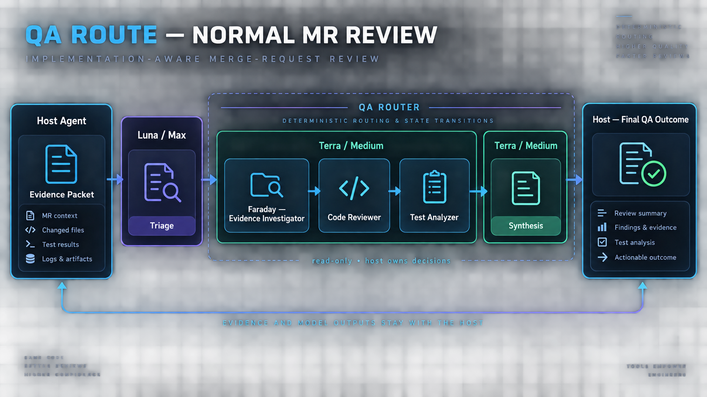
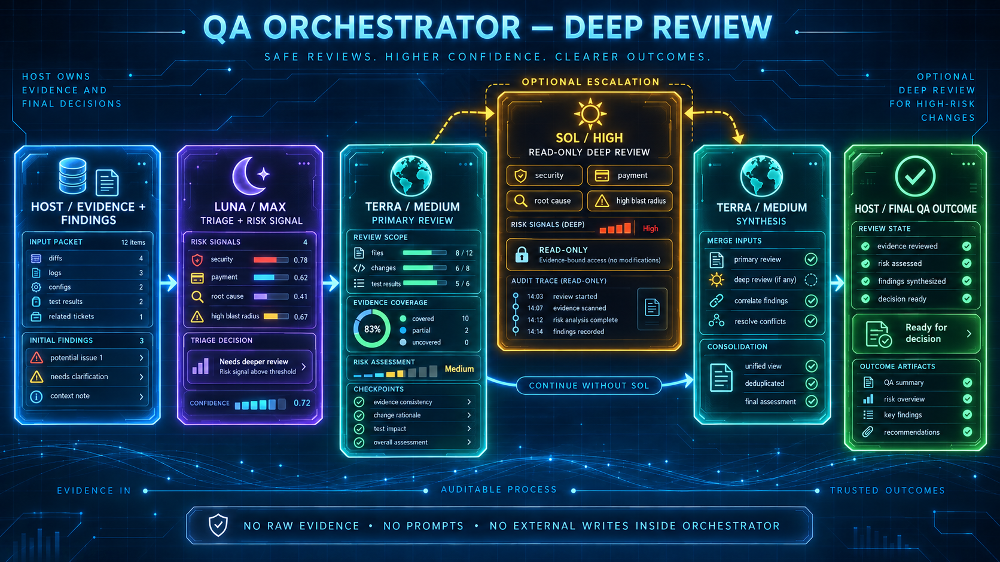

# QA Orchestrator Policy

This policy is client-neutral. The **primary host** — Codex, Claude Code, Cursor, or another MCP client — remains the main orchestrator and decision owner.

## Responsibility boundary

The primary host owns:

- task classification and retrieval of authoritative sources;
- converting the evidence state into a small set of content-free deep-review signals;
- requirements, diff, code, contract, log, and runtime analysis;
- launching model stages under the fixed policy and validating their responses;
- findings, severity, coverage, release/readiness judgment, and the final response;
- CodeGraph and source-MCP calls;
- code/file changes and all writes to external systems.

QA Orchestrator owns only deterministic profile routing, content-free orchestration state, deep-review signal evaluation, and aggregate metrics. The orchestrator does not accept evidence, prompts, or model outputs and does not perform autonomous writes.

## Model policy

| Stage | Model | Reasoning | Responsibility |
|---|---|---|---|
| Triage | `gpt-5.6-luna` | `max` | Select a fixed review bundle or compatibility profile and identify evidence gaps |
| Primary review | `gpt-5.6-terra` | `medium` | Perform sequential implementation-aware review of the selected profiles |
| Deep escalation | `gpt-5.6-sol` | `high` | Optional read-only check for a complex or high-risk case |
| Synthesis | `gpt-5.6-terra` | `medium` | Consolidate the result after host validation |

The orchestrator returns only the next policy and transition constraints. Every policy includes the fixed `speed=1.0`; the primary host must preserve it when running the selected model. The primary host runs the models in its own environment, validates findings, and makes the final decision. The orchestrator does not invoke or throttle a provider itself.

## Orchestration flow

1. The host calls `start_qa_orchestration(task_type)` and receives a `run_id`, Luna/max, and the next action.
2. After triage, the host calls `advance_qa_orchestration` with one fixed bundle or one of the seven `ReviewAgent` profiles.
3. For a bundle, the host runs Terra once per profile in the returned order and passes the role identifier as `completed_profile` after each stage; the orchestrator does not skip roles or accept an arbitrary order.
4. In the same transition that completes the last Terra profile, the host may supply structured `risk_signals`; the orchestrator applies the fixed deep-review rules and either goes directly to Terra synthesis or returns optional Sol/high with the derived reason codes. Do not send `risk_signals` on the later synthesis transition.
5. After Sol, the host returns to Terra synthesis.
6. After synthesis, the state becomes `awaiting_host_outcome`; the host calls `record_qa_task_outcome` once with the same `run_id` and a status of `completed`, `partial`, or `blocked`. The orchestrator moves the session to its final status.

Allowed transitions:

```text
Luna triage → Terra profile[1] → ... → Terra profile[N]
                                      ↘ Sol deep review ↗
                                         Terra synthesis → awaiting host outcome
```

Sessions are content-free and in memory, with a default TTL of `1800` seconds and a default limit of `100` active sessions. The shared cache is bounded, so older terminal sessions may be evicted when new sessions are created. Unknown runs, expired sessions, illegal or repeated transitions, and invalid signals are rejected without changing state. After a restart, the host starts a new session.

Normal status flow for `ordinary_mr`:

```text
Luna / Max → Ordinary MR Review
Terra / Medium → Faraday — Evidence Investigator
Terra / Medium → Code Reviewer
Terra / Medium → Test Analyzer
Terra / Medium → Synthesis
Host → Final QA outcome
```

`Sol / High → Deep read-only review` appears only after the last Terra profile and only when the fixed signal rules match; the flow then returns to Terra synthesis.

### Adaptive profile selection

The single-profile compatibility path is the low-token route. Luna should select one profile instead of a full bundle only when the review has one narrow concern, one repository, low risk, and a small changed surface:

| Scope | Selection |
|---|---|
| Changed behavior, callers, or failure path | `code_reviewer` |
| Test-only or assertion-only change | `pr_test_analyzer` |
| TypeScript, async, or serialization-only change | `typescript_reviewer` |
| React state, effects, or rendering-only change | `react_reviewer` |

Use a fixed bundle when the scope is broad, crosses concerns, or needs evidence mapping plus implementation and test review. The orchestrator does not infer this from raw source; the host supplies the evidence to Luna and submits only the selected fixed profile or bundle.

### Compact review context

The host keeps one per-task Evidence Packet and gives each profile only the relevant sections. Evidence items use stable local references such as `E1`, `E2`, and findings use stable candidate identifiers such as `F-01`. A profile should return only bounded candidates with an evidence reference, confidence, and verification gap; it should not repeat the complete diff or raw logs. Synthesis receives the deduplicated candidates and references, not the full transcript of every profile.

### Deterministic deep-review decision

The host sends only boolean, content-free signals after the final Terra profile:

```json
{
  "high_risk_domain": true,
  "evidence_uncertain": true,
  "cross_system_scope": false,
  "multiple_plausible_causes": false,
  "evidence_conflict": false,
  "non_reproducible": false,
  "high_blast_radius": false
}
```

The orchestrator enters the single Sol/high branch when one of these rules matches:

1. `high_risk_domain` and `evidence_uncertain` are both true;
2. at least two complexity signals are true: `cross_system_scope`, `multiple_plausible_causes`, `non_reproducible`, or `high_blast_radius`;
3. `evidence_conflict` is true and the conflict is high-impact because `high_risk_domain`, `cross_system_scope`, or `high_blast_radius` is also true.

The returned `deep_assessment` contains `should_escalate`, matched fixed rules, fixed reason codes, and the complexity-signal count. No raw evidence is stored or sent to the orchestrator. Existing `needs_deep_analysis` plus one fixed `reason_code` remains accepted for client compatibility, but new clients should use `risk_signals`.

## Visual workflow

### Normal MR review



### Deep review escalation



## Fixed bundles and profile names

| Bundle | Ordered profiles |
|---|---|
| `ordinary_mr` | `code_explorer` → `code_reviewer` → `pr_test_analyzer` |
| `widget` | `code_explorer` → `react_reviewer` → `typescript_reviewer` → `pr_test_analyzer` |
| `security` | `code_explorer` → `security_reviewer` → `silent_failure_hunter` |
| `autotest` | `code_reviewer` → `pr_test_analyzer` → `typescript_reviewer` |
| `requirements` | `code_explorer` → `code_reviewer` |

| Technical profile | Display name |
|---|---|
| `code_explorer` | `Faraday — Evidence Investigator` |
| `code_reviewer` | `Code Reviewer` |
| `pr_test_analyzer` | `Test Analyzer` |
| `security_reviewer` | `Security Reviewer` |
| `silent_failure_hunter` | `Silent Failure Hunter` |
| `typescript_reviewer` | `TypeScript Reviewer` |
| `react_reviewer` | `React Reviewer` |

Faraday is the internal display name for `code_explorer`. It is not a separate external agent, service, package, or model. The orchestrator returns only the fixed identifier and order; the host runs Terra for each role.

## Review profiles

Use the narrowest profile that matches the task:

- `pr_test_analyzer` — test intent, branch coverage, and missing regression protection;
- `code_reviewer` — changed surface, caller impact, contracts, and failure paths;
- `security_reviewer` — authentication, authorization, validation, secrets, and data exposure;
- `silent_failure_hunter` — swallowed errors, fallback paths, false success, and observability;
- `code_explorer` — dependency map, callers, data flow, and affected surface;
- `typescript_reviewer` — TypeScript types, async boundaries, serialization, and build safety;
- `react_reviewer` — React state, effects, rendering, props, and user-visible behavior.

Every review must separate confirmed findings from hypotheses and unverified runtime or release facts. An empty or unknown profile is rejected before a route is built.

## Metrics contract

`record_qa_task_outcome` accepts only content-free fields:

- `task_type`, `outcome`;
- CodeGraph/source call counters;
- identified, confirmed, and rejected findings plus repeated source reads;
- `deep_model=gpt-5.6-sol` and `deep_reasoning=high` for an orchestrated Sol branch; duration and token measurements are optional;
- `orchestration_used`, `luna_calls`, `terra_calls`, `sol_calls`, `orchestration_steps_completed`, and `orchestration_retries`.
- For a completed bundle with `N` Terra profiles, the minimum counters are `luna_calls=1`, `terra_calls=N+1`, and `orchestration_steps_completed=N+2`; add one Sol call and one step when deep review ran.
- `deep_escalation_recommended` and fixed `deep_escalation_reason_codes` for orchestrated tasks.
- optional per-stage token counters: `luna_input_tokens`, `luna_output_tokens`, `terra_primary_input_tokens`, `terra_primary_output_tokens`, `deep_input_tokens`, `deep_output_tokens`, `terra_synthesis_input_tokens`, and `terra_synthesis_output_tokens`;
- optional scope counters: `evidence_packet_tokens`, `merge_requests_count`, and `repositories_count`;
- optional Sol-value counters: `deep_findings_identified`, `deep_findings_new_confirmed`, and `deep_findings_rejected`.

When `run_id` is present, the outcome is treated as orchestrated automatically; `orchestration_used=true` may also be sent explicitly, while an explicit false value is rejected. The opaque identifier is used only to associate the final outcome and aggregate counters with the in-memory session, is checked against the selected branch, and is not persisted in JSONL.

Orchestration counters must be non-negative and are not accepted as positive when orchestration was not used. Do not send issue keys, titles, paths, source text, code, logs, screenshots, or generated content. `get_metrics_report(days)` returns aggregates and data-quality counters only.

## MCP tools

The orchestrator must publish exactly:

- `prepare_review_route`;
- `start_qa_orchestration`;
- `advance_qa_orchestration`;
- `get_qa_orchestration`;
- `record_qa_task_outcome`;
- `get_metrics_report`.

`read_only=true` and `host_owns_decisions=true` must be preserved in every orchestration state. Do not add a tool that generates text, accepts evidence, changes external state, selects a model for the host, or silently calls another agent.

## Persistence and safety

The service does not store task content, conversation history, a source cache, or persistent QA memory. Before adding a field, verify that it can be aggregated without exposing its source and that the primary host still makes the final decision.
