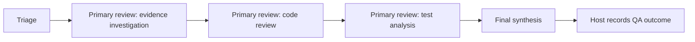
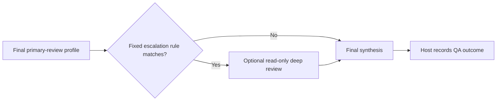

# QA Orchestrator Policy

The MCP transport, setup wizard, and responsibility boundary are client-neutral.
The **primary host** — Codex or Claude Code —
remains the main orchestrator and decision owner. The selected model IDs are
configuration metadata; the host still owns model execution and validation.

## Responsibility boundary

The primary host owns:

- task classification and retrieval of authoritative sources;
- converting the evidence state into a small set of content-free deep-review signals;
- requirements, diff, code, contract, log, and runtime analysis;
- launching model stages under the fixed policy and validating their responses;
- findings, severity, coverage, release/readiness judgment, and the final response;
- CodeGraph and source-MCP calls;
- code/file changes and all writes to external systems.

QA Orchestrator owns only deterministic profile routing, content-free orchestration state, deep-review signal evaluation, and aggregate task distribution. The orchestrator does not accept evidence, prompts, or model outputs and does not perform autonomous writes.

## Model policy

The local console command `qa-orch setup` selects OpenAI or Anthropic and four
model IDs. It also selects provider-specific reasoning/effort for triage,
primary review, synthesis, and deep review: OpenAI uses `reasoning.effort`,
while Anthropic uses `output_config.effort`. `none` means that the
provider-specific parameter is omitted. `high` remains the default
recommendation for deep escalation when the selected model supports it. The
selected values are returned in each active session's `model_policy`; the
orchestrator never calls the models and never stores API keys. The default
remains OpenAI/Codex. Model IDs and reasoning are configured independently for
each stage and returned in the session's `model_policy`.

| Stage | Selected model | Reasoning / effort | Responsibility |
|---|---|---|---|
| Triage | configured `triage_model` | configured `triage_reasoning` (default `max`) | Select a fixed review bundle or compatibility profile and identify evidence gaps |
| Primary review | configured `primary_model` | configured `primary_reasoning` (default `medium`) | Perform sequential implementation-aware review of the selected profiles |
| Deep escalation | configured `deep_model` | configured `deep_reasoning` (default `high`) | Optional read-only check for a complex or high-risk case |
| Synthesis | configured `synthesis_model` | configured `synthesis_reasoning` (default `medium`) | Consolidate the result after host validation |

The orchestrator returns only the next policy and transition constraints. Every policy includes the fixed `speed=1.0`; the primary host must preserve it when running the selected model. The primary host runs the models in its own environment, validates findings, and makes the final decision. The orchestrator does not invoke or throttle a provider itself.

## Orchestration flow

1. The host calls `start_qa_orchestration(task_type)` and receives a `run_id`, the configured triage model and reasoning effort (default `max`), and the next action.
2. After triage, the host calls `advance_qa_orchestration` with one fixed bundle or one of the seven `ReviewAgent` profiles.
3. For a bundle, the host runs the configured primary model once per profile in the returned order and passes the role identifier as `completed_profile` after each stage; the orchestrator does not skip roles or accept an arbitrary order.
4. In the same transition that completes the last primary-review profile, the host must supply structured `risk_signals` (use an empty object when no signals apply); the orchestrator applies the fixed deep-review rules and either goes directly to configured synthesis or returns the configured deep model with its configured reasoning (default `high`). Do not send `risk_signals` on the later synthesis transition. The legacy explicit manual-escalation input remains accepted for older clients.
5. After deep review, the host returns to the configured synthesis model.
6. After synthesis, the state becomes `awaiting_host_outcome`; the host calls `record_qa_task_outcome` once with the same `run_id` and a status of `completed`, `partial`, or `blocked`. The orchestrator moves the session to its final status. For non-orchestrated tasks, records have no deduplication key: do not retry after an uncertain response, and interpret counts as successful record calls rather than verified unique tasks.

Allowed transitions:

```text
Triage → Primary review[1] → ... → Primary review[N]
                                      ↘ Deep review ↗
                                   Final synthesis → awaiting host outcome
```

Transition identifiers are model-neutral, not model selectors: use the returned `model_policy` for each stage.

Sessions are content-free and in memory, with a default TTL of `1800` seconds and a default limit of `100` active sessions. The shared cache is bounded, so older terminal sessions may be evicted when new sessions are created. Unknown runs, expired sessions, illegal or repeated transitions, and invalid signals are rejected without changing state. After a restart, the host starts a new session.

Normal status flow for `ordinary_mr`:

```text
Triage → Ordinary MR Review
Primary review → Faraday — Evidence Investigator
Primary review → Code Reviewer
Primary review → Test Analyzer
Final synthesis
Host → Final QA outcome
```

Deep read-only review appears only after the last primary-review profile and when the fixed signal rules match; the flow then continues to final synthesis.

### Adaptive profile selection

The single-profile compatibility path is for narrow reviews. The triage stage should select one profile instead of a full bundle only when the review has one narrow concern, one repository, low risk, and a small changed surface:

| Scope | Selection |
|---|---|
| Changed behavior, callers, or failure path | `code_reviewer` |
| Test-only or assertion-only change | `pr_test_analyzer` |
| TypeScript, async, or serialization-only change | `typescript_reviewer` |
| React state, effects, or rendering-only change | `react_reviewer` |

Use a fixed bundle when the scope is broad, crosses concerns, or needs evidence mapping plus implementation and test review. The orchestrator does not infer this from raw source; the host supplies evidence for triage and submits only the selected fixed profile or bundle.

### Compact review context

The host keeps one per-task Evidence Packet and gives each profile only the relevant sections. Evidence items use stable local references such as `E1`, `E2`, and findings use stable candidate identifiers such as `F-01`. A profile should return only bounded candidates with an evidence reference, confidence, and verification gap; it should not repeat the complete diff or raw logs. Synthesis receives the deduplicated candidates and references, not the full transcript of every profile.

### Deterministic deep-review decision

The host sends only boolean, content-free signals after the final primary-review profile:

```json
{
  "high_risk_domain": true,
  "evidence_uncertain": true,
  "cross_system_scope": false,
  "multiple_plausible_causes": false,
  "evidence_conflict": false,
  "non_reproducible": false,
  "high_blast_radius": false
}
```

The orchestrator enters the optional deep-review branch when one of these rules matches:

1. `high_risk_domain` and `evidence_uncertain` are both true;
2. at least two complexity signals are true: `cross_system_scope`, `multiple_plausible_causes`, `non_reproducible`, or `high_blast_radius`;
3. `evidence_conflict` is true and the conflict is high-impact because `high_risk_domain`, `cross_system_scope`, or `high_blast_radius` is also true.

The returned `deep_assessment` contains `should_escalate`, matched fixed rules, fixed reason codes, and the complexity-signal count. No raw evidence is stored or sent to the orchestrator. Existing `needs_deep_analysis` plus one fixed `reason_code` remains accepted for client compatibility, but new clients should use `risk_signals`.

## Visual workflow

### Normal MR review



### Deep review escalation



## Fixed bundles and profile names

| Bundle | Ordered profiles |
|---|---|
| `ordinary_mr` | `code_explorer` → `code_reviewer` → `pr_test_analyzer` |
| `widget` | `code_explorer` → `react_reviewer` → `typescript_reviewer` → `pr_test_analyzer` |
| `security` | `code_explorer` → `security_reviewer` → `silent_failure_hunter` |
| `autotest` | `code_reviewer` → `pr_test_analyzer` → `typescript_reviewer` |
| `requirements` | `code_explorer` → `code_reviewer` |

| Technical profile | Display name |
|---|---|
| `code_explorer` | `Faraday — Evidence Investigator` |
| `code_reviewer` | `Code Reviewer` |
| `pr_test_analyzer` | `Test Analyzer` |
| `security_reviewer` | `Security Reviewer` |
| `silent_failure_hunter` | `Silent Failure Hunter` |
| `typescript_reviewer` | `TypeScript Reviewer` |
| `react_reviewer` | `React Reviewer` |

Faraday is the internal display name for `code_explorer`. It is not a separate external agent, service, package, or model. The orchestrator returns only the fixed identifier and order; the host runs the configured primary model for each role.

## Review profiles

Use the narrowest profile that matches the task:

- `pr_test_analyzer` — test intent, branch coverage, and missing regression protection;
- `code_reviewer` — changed surface, caller impact, contracts, and failure paths;
- `security_reviewer` — authentication, authorization, validation, secrets, and data exposure;
- `silent_failure_hunter` — swallowed errors, fallback paths, false success, and observability;
- `code_explorer` — dependency map, callers, data flow, and affected surface;
- `typescript_reviewer` — TypeScript types, async boundaries, serialization, and build safety;
- `react_reviewer` — React state, effects, rendering, props, and user-visible behavior.

Every review must separate confirmed findings from hypotheses and unverified runtime or release facts. An empty or unknown profile is rejected before a route is built.

## Task distribution

`record_qa_task_outcome` accepts only `task_type`, `outcome`, and an optional `run_id`:

- `task_type` identifies one supported QA task category.
- `outcome` finalizes an orchestrated session; it is not saved in distribution data.
- `run_id` associates the final call with its in-memory session; it is not persisted.

The distribution record stores only the task type and timestamp. The report returns `period_days`, `total_tasks`, and `by_task_type`.

On MCP-server or report-command startup, existing outcome events are migrated to the distribution format, retaining only their timestamp and task type; unrelated fields and malformed records are discarded. Do not send issue keys, titles, paths, source text, code, logs, screenshots, or generated content.

## MCP tools

The orchestrator must publish exactly:

- `prepare_review_route`;
- `start_qa_orchestration`;
- `advance_qa_orchestration`;
- `get_qa_orchestration`;
- `record_qa_task_outcome`;
- `get_metrics_report`.

`read_only=true` and `host_owns_decisions=true` must be preserved in every orchestration state. Do not add a tool that generates text, accepts evidence, changes external state, selects a model for the host, or silently calls another agent.

## Persistence and safety

The service does not store task content, conversation history, a source cache, or persistent QA memory. Before adding a field, verify that it can be aggregated without exposing its source and that the primary host still makes the final decision.
