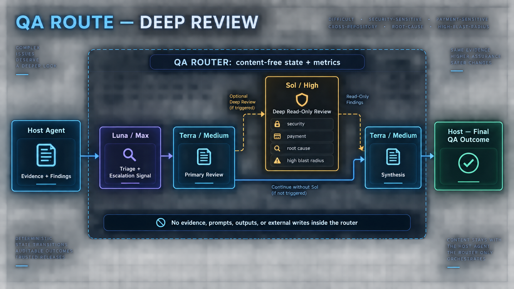

# QA Router Policy

This policy is client-neutral. The **primary host** — Codex, Claude Code, Cursor, or another MCP client — remains the main orchestrator and decision owner.

## Responsibility boundary

The primary host owns:

- task classification and retrieval of authoritative sources;
- requirements, diff, code, contract, log, and runtime analysis;
- launching model stages under the fixed policy and validating their responses;
- findings, severity, coverage, release/readiness judgment, and the final response;
- CodeGraph and source-MCP calls;
- code/file changes and all writes to external systems.

QA Router owns only deterministic profile routing, content-free orchestration state, and aggregate metrics. The router does not accept evidence, prompts, or model outputs and does not perform autonomous writes.

## Model policy

| Stage | Model | Reasoning | Responsibility |
|---|---|---|---|
| Triage | `gpt-5.6-luna` | `max` | Select a fixed review bundle or compatibility profile and identify evidence gaps |
| Primary review | `gpt-5.6-terra` | `medium` | Perform sequential implementation-aware review of the selected profiles |
| Deep escalation | `gpt-5.6-sol` | `high` | Optional read-only check for a complex or high-risk case |
| Synthesis | `gpt-5.6-terra` | `medium` | Consolidate the result after host validation |

The router returns only the next policy and transition constraints. Every policy includes the fixed `speed=1.0`; the primary host must preserve it when running the selected model. The primary host runs the models in its own environment, validates findings, and makes the final decision. The router does not invoke or throttle a provider itself.

## Orchestration flow

1. The host calls `start_qa_orchestration(task_type)` and receives a `run_id`, Luna/max, and the next action.
2. After triage, the host calls `advance_qa_orchestration` with one fixed bundle or one of the seven `ReviewAgent` profiles.
3. For a bundle, the host runs Terra once per profile in the returned order and passes the role identifier as `completed_profile` after each stage; the router does not skip roles or accept an arbitrary order.
4. After the last Terra profile, the host either goes directly to Terra synthesis or supplies one fixed `reason_code` and receives optional Sol/high.
5. After Sol, the host returns to Terra synthesis.
6. After synthesis, the state becomes `awaiting_host_outcome`; the host calls `record_qa_task_outcome` once with the same `run_id` and a status of `completed`, `partial`, or `blocked`. The router moves the session to its final status.

Allowed transitions:

```text
Luna triage → Terra profile[1] → ... → Terra profile[N]
                                      ↘ Sol deep review ↗
                                         Terra synthesis → awaiting host outcome
```

Sessions are content-free and in memory, with a default TTL of `1800` seconds and a default limit of `100` active sessions. The shared cache is bounded, so older terminal sessions may be evicted when new sessions are created. Unknown runs, expired sessions, illegal or repeated transitions, and invalid signals are rejected without changing state. After a restart, the host starts a new session.

Normal status flow for `ordinary_mr`:

```text
Luna / Max → Ordinary MR Review
Terra / Medium → Faraday — Evidence Investigator
Terra / Medium → Code Reviewer
Terra / Medium → Test Analyzer
Terra / Medium → Synthesis
Host → Final QA outcome
```

`Sol / High → Deep read-only review` appears only after the last Terra profile and only with one fixed `reason_code`; the flow then returns to Terra synthesis.

## Visual workflow

### Normal MR review


### Deep review escalation



## Fixed bundles and profile names

| Bundle | Ordered profiles |
|---|---|
| `ordinary_mr` | `code_explorer` → `code_reviewer` → `pr_test_analyzer` |
| `widget` | `code_explorer` → `react_reviewer` → `typescript_reviewer` → `pr_test_analyzer` |
| `security` | `code_explorer` → `security_reviewer` → `silent_failure_hunter` |
| `autotest` | `code_reviewer` → `pr_test_analyzer` → `typescript_reviewer` |
| `requirements` | `code_explorer` → `code_reviewer` |

| Technical profile | Display name |
|---|---|
| `code_explorer` | `Faraday — Evidence Investigator` |
| `code_reviewer` | `Code Reviewer` |
| `pr_test_analyzer` | `Test Analyzer` |
| `security_reviewer` | `Security Reviewer` |
| `silent_failure_hunter` | `Silent Failure Hunter` |
| `typescript_reviewer` | `TypeScript Reviewer` |
| `react_reviewer` | `React Reviewer` |

Faraday is the internal display name for `code_explorer`. It is not a separate external agent, service, package, or model. The router returns only the fixed identifier and order; the host runs Terra for each role.

## Review profiles

Use the narrowest profile that matches the task:

- `pr_test_analyzer` — test intent, branch coverage, and missing regression protection;
- `code_reviewer` — changed surface, caller impact, contracts, and failure paths;
- `security_reviewer` — authentication, authorization, validation, secrets, and data exposure;
- `silent_failure_hunter` — swallowed errors, fallback paths, false success, and observability;
- `code_explorer` — dependency map, callers, data flow, and affected surface;
- `typescript_reviewer` — TypeScript types, async boundaries, serialization, and build safety;
- `react_reviewer` — React state, effects, rendering, props, and user-visible behavior.

Every review must separate confirmed findings from hypotheses and unverified runtime or release facts. An empty or unknown profile is rejected before a route is built.

## Metrics contract

`record_qa_task_outcome` accepts only content-free fields:

- `task_type`, `outcome`;
- CodeGraph/source call counters;
- identified, confirmed, and rejected findings plus repeated source reads;
- `deep_model=gpt-5.6-sol` and `deep_reasoning=high` for an orchestrated Sol branch; duration and token measurements are optional;
- `orchestration_used`, `luna_calls`, `terra_calls`, `sol_calls`, `orchestration_steps_completed`, and `orchestration_retries`.

When `run_id` is present, the outcome is treated as orchestrated automatically; `orchestration_used=true` may also be sent explicitly, while an explicit false value is rejected. The opaque identifier is used only to associate the final outcome and aggregate counters with the in-memory session, is checked against the selected branch, and is not persisted in JSONL.

Orchestration counters must be non-negative and are not accepted as positive when orchestration was not used. Do not send issue keys, titles, paths, source text, code, logs, screenshots, or generated content. `get_metrics_report(days)` returns aggregates and data-quality counters only.

## MCP tools

The router must publish exactly:

- `prepare_review_route`;
- `start_qa_orchestration`;
- `advance_qa_orchestration`;
- `get_qa_orchestration`;
- `record_qa_task_outcome`;
- `get_metrics_report`.

`read_only=true` and `host_owns_decisions=true` must be preserved in every orchestration state. Do not add a tool that generates text, accepts evidence, changes external state, selects a model for the host, or silently calls another agent.

## Persistence and safety

The service does not store task content, conversation history, a source cache, or persistent QA memory. Before adding a field, verify that it can be aggregated without exposing its source and that the primary host still makes the final decision.
